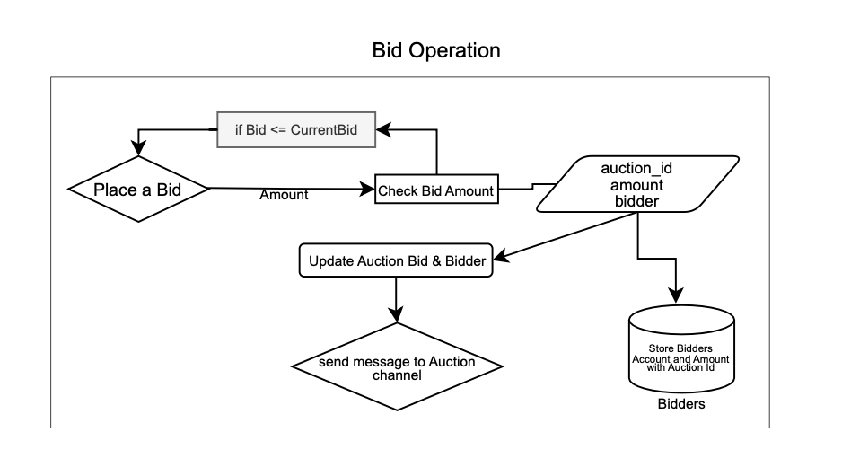
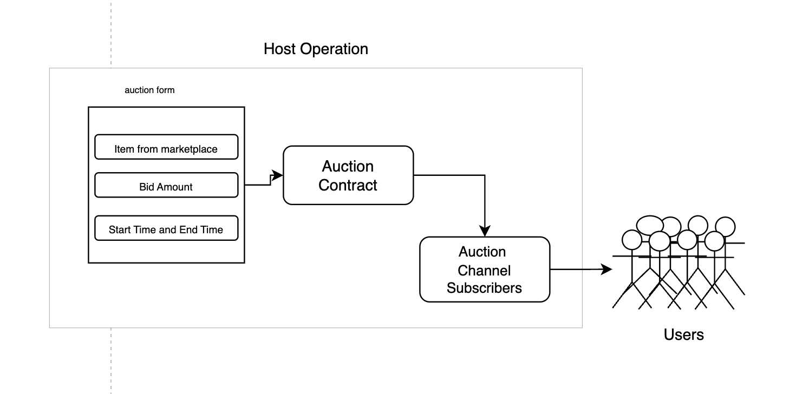
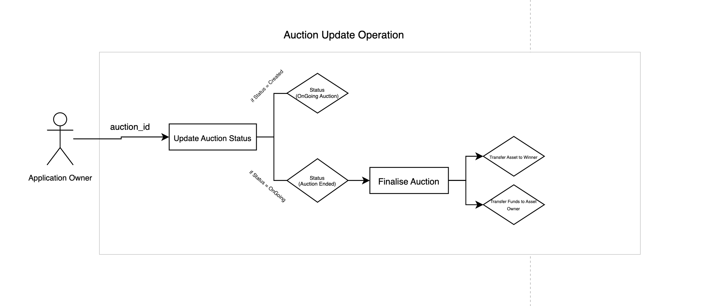

# LinLin: Auction System on Linera

LinLin is an auction system built on the Linera blockchain. It is a decentralized application that allows users to create, bid on, and manage auctions for various items. With LinLin, users can easily create new auctions by providing details such as the item name, description, start and end times, and starting bid amount. Bidders can place their bids on ongoing auctions, and the highest bid will be accepted as the winner when the auction ends. The contract also handles the transfer of ownership of the auctioned item from the seller to the highest bidder. LinLin ensures authentication and authorization, making sure that only authenticated users can create auctions and participate in bidding. It provides a seamless and secure platform for conducting auctions on the Linera protocol.

## Auction Workflow


### Bid Operation



### Auction Host Operation



### Auction Update Status Operation



## Auction

Auction Contract
The Auction Contract is a decentralized application built using the Linera SDK. It allows users to create, bid on, and manage auctions for various items on the Linera blockchain.
Features

**_Auction Creation_**: Users can create new auctions by providing details such as the item name, description, start and end times, and starting bid amount.
**_Bidding_**: Users can place bids on ongoing auctions. The highest bid will be accepted as the winner when the auction ends.
**_Auction Status Tracking_**: The contract keeps track of the current status of each auction (created, ongoing, ended, or canceled).
**_Asset Transfer_**: When an auction ends, the ownership of the auctioned item is transferred from the seller to the highest bidder.
**_Fund Management_**: The contract handles fund transfers between users, including the initial deposit for participating in auctions and the final payout to the seller and bidders.
**_Authentication and Authorization_**: The contract ensures that only authenticated users can create auctions and participate in bidding.

### Contract Files

- `lib.rs`: This file contains the contract ABI (Application Binary Interface) definition, operations, messages, and error handling.
- `contract.rs`: This file contains the main contract implementation, including auction creation, bidding, status updates, and asset transfers.
- `state.rs`: This file defines the contract state and provides methods for managing auctions, bids, and user accounts.
- `service.rs`: This file defines the service implementation for handling GraphQL queries.

Dependencies
The Auction Contract relies on the following contracts:

LinCoin Contract: Used for managing user funds and facilitating token transfers.
Market Contract: Used for transferring the ownership of auctioned items.

## LinCoin

LinCoin is a fungible token contract built using the Linera SDK. It allows users to transfer tokens, check balances, and manage accounts. The contract is written in Rust and can be deployed on the Linera blockchain.
Features

**_Balance Checking_**: Users can check their token balance by providing their account owner.
**_Token Transfer_**: Users can transfer tokens from their account to another account within the same chain or across different chains.
**_Fund Transfer_**: Users can transfer tokens directly to a target account, bypassing the need for the recipient's account owner.
**_Account Management_**: The contract supports creating and managing accounts during instantiation.

### Contract Files

- `lib.rs`: This file contains the contract ABI (Application Binary Interface) definition, operations, and response types.
- `contract.rs`: This file contains the main contract implementation, including account authentication, token transfers, and message handling.
- `state.rs`: This file defines the contract state and provides methods for account balance management.
- `service.rs`: This file defines the service implementation for handling GraphQL queries.

## Market Contract

This project implements a market system using the Rust programming language and the `linera_sdk`. The system manages items within a market, handles ownership, and provides a GraphQL API for interaction.

### Contract Files

- `state.rs`: Manages the state of the market, including item management and ownership transfers.
- `service.rs`: Defines the service layer, including GraphQL schema and query handling.
- `contract.rs`: Implements the core logic of the market contract.
- `lib.rs`: Main library entry point, re-exporting necessary components and integrating different modules.

**_Market Management_**: Add, retrieve, and update items within the market.
**_Ownership Transfer_**: Handle the transfer of item ownership.
**_GraphQL API_**: Provides a GraphQL API for querying and mutating the market state.

### Prerequisites

- Rust (latest stable version)
- `linera_sdk`

## Compiling and Deployment

### CMD

```
git clone https://github.com/linera-project/linera-protocol.git
cd linera-protocol
cargo install --path linera-service
git clone https://github.com/Nirajsah/LinLin.git
cd LinLin

// this will spawn 2 wallets
linera_spawn_and_read_wallet_variables linera net up --extra-wallets 1 --testing-prng-seed 37

cd lincoin
// publish lincoin application --with-wallet 0
LINCOIN_ID=$(linera --with-wallet 0 project publish-and-create \
    --json-argument "{ \"accounts\": {
        // not passing any initialisation arguments here.
    } }"

)

cd market
// publish market application --with-wallet 0
MARKET_ID=$(linera --with-wallet 0 project publish-and-create --json-argument "null" ) // not passing any initialisation arguments

cd auction
// publish auction application --with-wallet 0, and lincoin and market as application parameters.
AUCTION_ID=$(linera --with-wallet 0 project publish-and-create \
	   --required-application-ids $LINCOIN_ID \
	   --required-application-ids $MARKET_ID \
           --json-argument "null" \
	   --json-parameters "{\"lincoin_app_id\":\"$LINCOIN_ID\", \"market_app_id\":\"$MARKET_ID\"}")


// running application on port 8080 and 8081
linera --with-wallet 0 service --port 8080
linera --with-wallet 1 service --port 8081
```

### make sure `LINCOIN_ID`, `AUCTION_ID`, `MARKET_ID` are passed inside the `client/src/constants/const`

### Installation && Deploying Clinet

Install bunjs,

```
cd client
bun install
bun dev

bun build // for production(optional)
bun preview

```

This README provides a detailed overview of your project, instructions for getting started, usage examples, and other relevant information to help users and developers understand and use your market service. &#8203;:citation[oaicite:0]{index=0}&#8203;
